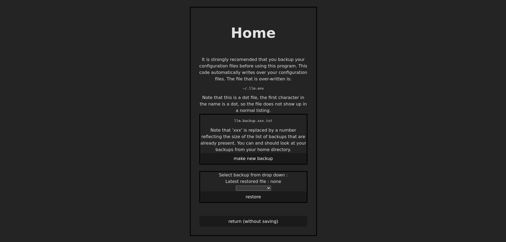

# config-llm

`Project to implement a config editing program for pi-llm.`

---

The idea behind this program is to provide a way to edit the config file for the pi-llm project. I want to make it so that the config can be changed here, and then the pi-llm code would see the change and start over and load the new config without stopping the program and re-starting it.

This can be achieved by editing the pi-llm project slightly and coding this project to save all config changes. Then if a restart is required, a flag file is saved in the user's home directory. The pi-llm code checks for this flag file regularly, and if it sees it, the pi-llm code is restarted. This is so that the `~\.llm.env` file is not updated often. 

This project uses docker and two docker images. One image is the client, which has the graphical interface that we like. The other image, the express server, is used as a backend, and is responsible for manipulating the files on the host system. The whole thing should be usable on the raspberry pi.

The pi-llm project uses a wifi connenction on the raspberry pi to access AI Api's from the web.

## Pictures:



## Command Line Notes:

Below are some command notes for instructions I sometimes forget or don't use often.

```
npm install --save [packagename]@[version]

npm run build
npm run dev 

sudo docker ps
sudo docker kill ff

docker image prune -a

docker image rmi --force $(docker images -a -q)

sudo docker image rmi --force $(sudo docker images -a -q)

sudo docker build -t config-llm .

sudo docker run -it config-llm bash
sudo docker run -p 5173:5173 config-llm

docker run -p 8008:8008 --mount type=bind,source=/home,destination=/home server-llm

docker logs -f nginx 1>/dev/null

```
